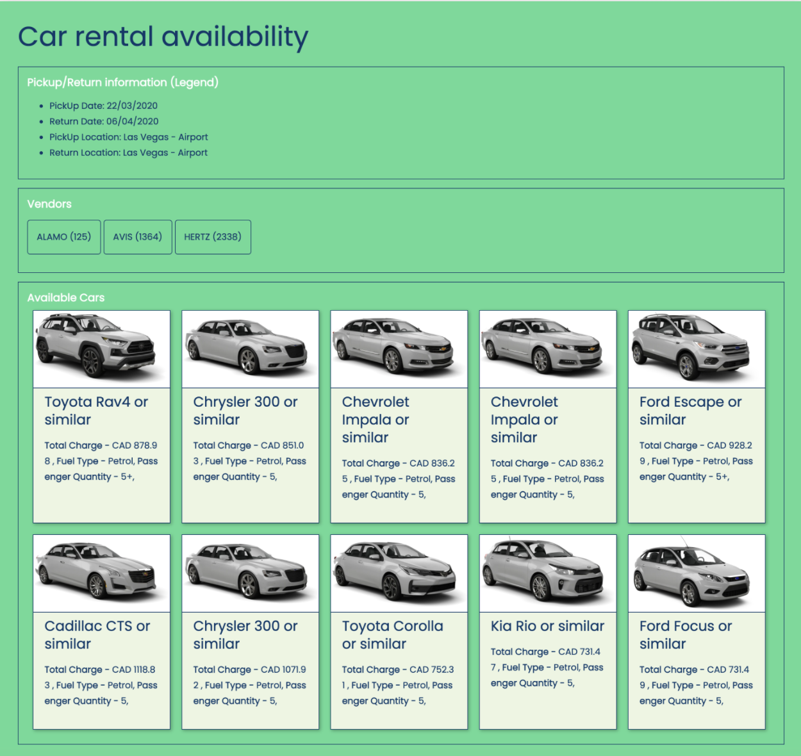

# car-rental-availability

## Overview

Using React, create a website that displays a visual representation of the following feed.
  

## Features

- Boilerplate - Used create-react-app
- Project Structure - It seemed natural for me to organize files by type when I first started using React. However, got the opportunity to work on some larger projects, I am well aware of how difficult it can be to browse through the files as a project becomes larger.
- EsLint, Prettier and AirBnb React Style guide - For large-scale projects getting all the developers to follow a consistent style of code can be tricky. It can take the help of two awesome libraries eslint and prettier.
- State management / Global Store - This is just small project where I have just used to react-router-dom feature to pass data to another route. Otherwise It will helpful use any one of the State management tool such as redux, Recoil, Jotai and Zustand.
- I have created functional component intead of class component.
- Routing - React doesn’t provide an official library for routing on the client side. But react-router-dom is by far the go-to choice for most projects.
- UI - I was planning to use one of the UI library however I just used HTML, SCSS and ES6.
- Styling - We can use plain old css for our component, but in this modern age, we should use a sass setup for better styling.
- HTTP Query - I have used fetch, async, await however, Fetching data from the remote server is one of the most common tasks for dynamic react applications. For standard CRUD operations, Axios is a great choice.
- Utility - I have created a utility file that contains all of the common functions that we may utilize in our project.
- I have just covered snapshot testing.
- Used Heroku for CI/CD and deployment.

## GitHub Repo

[car-rental-availability](https://github.com/shreelimbkar/car-rental-availability)

## Installation

Install the dependencies and devDependencies and start the server.

```sh
git clone https://github.com/shreelimbkar/car-rental-availability.git
cd car-rental-availability
npm i or yarn
npm start or yarn start

```

#### Building for source

For production release:

```sh
npm run build --prod or yarn run build
```

Deploy on Github Pages for distribution:

```sh
npm run deploy or yarn run deploy
```

#### Pending items or issues

Due to a lack of time, I was unable to address all of the points; nevertheless, I feel that there is always room for improvement, which can be accomplished gradually as we have a greater understanding of the functionality / feature. The following are a few issues that I believe may be improved.

- Component spliting
- Need to refactor styling
- Any one of the UI library can be used.
- Vendor group by feature can be improved.
- I have github pages to deploy application however facing some issue with "homepage" option in package.json
- All the scenarios should be covered in Test cases.
